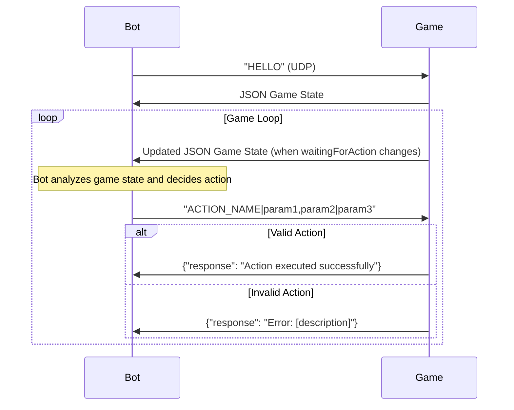

# Balatro Bot API Protocol

This document provides the UDP protocol reference for developing bots that interface with Balatro via raw UDP sockets.

## UDP Communication

The Balatro Bot API uses UDP sockets for real-time communication between the game and external bot clients.

**Connection Details:**

- **Host:** `127.0.0.1` (localhost)
- **Port:** `12346` (default)
- **Protocol:** UDP

## Communication Sequence



## Message Formats

**Handshake**
```
Bot -> Game: "HELLO"
Game -> Bot: {JSON game state with waitingFor field}
```

**Action Request**
```
Bot -> Game: "ACTION_NAME|param1,param2|param3,param4"
```

**Responses**
```
Success: {"response": "Action executed successfully"}
Error:   {"response": "Error: [description]"}
```

## Game State JSON

The game sends JSON containing:

- **waitingFor**: What action type the game expects
- **waitingForAction**: Boolean indicating if bot input is needed
- **gamestate**: Current game phase and data
- **hand**: Player's current hand cards
- **jokers**: Active joker cards
- **consumables**: Available consumable cards  
- **shop**: Shop items and costs
- **blinds**: Current blind information
- **round**: Round data (hands/discards remaining, etc.)

Key field for bots: **waitingForAction** - only send actions when this is `true`.

## Available Actions

Actions use pipe-separated format: `ACTION_NAME|param1,param2|param3,param4`


| Action | Parameters | Description | Valid When waitingFor |
|--------|------------|-------------|------------|
| `SELECT_BLIND` | `1` | Select the current blind | `skip_or_select_blind` |
| `SKIP_BLIND` | `2` | Skip the current blind | `skip_or_select_blind` |
| `PLAY_HAND` | `3|card_indices` | Play selected cards | `select_cards_from_hand` |
| `DISCARD_HAND` | `4|card_indices` | Discard selected cards | `select_cards_from_hand` |
| `END_SHOP` | `5` | Leave the shop | `select_shop_action` |
| `REROLL_SHOP` | `6` | Reroll shop items | `select_shop_action` |
| `BUY_CARD` | `7|shop_index` | Buy joker from shop | `select_shop_action` |
| `BUY_VOUCHER` | `8|voucher_index` | Buy voucher from shop | `select_shop_action` |
| `BUY_BOOSTER` | `9|booster_index` | Buy booster pack | `select_shop_action` |
| `SELECT_BOOSTER_CARD` | `10|pack_index|hand_indices` | Use consumable on cards | `select_booster_action` |
| `SKIP_BOOSTER_PACK` | `11` | Skip booster pack | `select_booster_action` |
| `SELL_JOKER` | `12|joker_indices` | Sell joker cards | `sell_jokers` |
| `USE_CONSUMABLE` | `13|consumable_indices` | Use consumable cards | `use_or_sell_consumables` |
| `SELL_CONSUMABLE` | `14|consumable_indices` | Sell consumable cards | `use_or_sell_consumables` |
| `REARRANGE_JOKERS` | `15|new_order` | Reorder joker positions | `rearrange_jokers` |
| `REARRANGE_CONSUMABLES` | `16|new_order` | Reorder consumable positions | `rearrange_consumables` |
| `REARRANGE_HAND` | `17|new_order` | Reorder hand cards | `rearrange_hand` |
| `PASS` | `18` | Do nothing (always valid) | Any state |
| `START_RUN` | `19|stake|deck|seed|challenge` | Start new run | `start_run` |


**Card Indices:** 1-based array of card positions

- Example: `PLAY_HAND|3|1,3,5` (play cards at positions 1, 3, and 5)

**Shop Indices:** 1-based position in shop

- Example: `BUY_CARD|7|2` (buy second joker in shop)

**Reorder Arrays:** Complete new ordering (all positions)

- Example: `REARRANGE_JOKERS|15|3,1,2,4` (move 3rd joker to 1st position, etc.)

**Run Parameters:**

- stake: 1-8 (difficulty)
- deck: deck name string
- seed: seed string or empty
- challenge: challenge name or empty

## Game States


| waitingFor State | Description | Valid Actions |
|------------------|-------------|---------------|
| `start_run` | Main menu | `START_RUN` |
| `skip_or_select_blind` | Blind selection screen | `SELECT_BLIND`, `SKIP_BLIND` |
| `select_cards_from_hand` | Playing/discarding phase | `PLAY_HAND`, `DISCARD_HAND` |
| `select_shop_action` | In shop | `END_SHOP`, `REROLL_SHOP`, `BUY_CARD`, `BUY_VOUCHER`, `BUY_BOOSTER` |
| `select_booster_action` | Opening booster packs | `SELECT_BOOSTER_CARD`, `SKIP_BOOSTER_PACK` |
| `sell_jokers` | Joker management | `SELL_JOKER` |
| `use_or_sell_consumables` | Consumable management | `USE_CONSUMABLE`, `SELL_CONSUMABLE` |
| `rearrange_jokers` | Joker positioning | `REARRANGE_JOKERS` |
| `rearrange_consumables` | Consumable positioning | `REARRANGE_CONSUMABLES` |
| `rearrange_hand` | Hand card positioning | `REARRANGE_HAND` |


## Error Handling

The game validates all actions and returns errors for:

- **Invalid format:** Incorrect action syntax
- **Invalid parameters:** Wrong number or type of parameters  
- **Invalid state:** Action not allowed in current game state
- **Invalid indices:** References to non-existent cards/items
- **Insufficient resources:** Not enough money, hands, discards, etc.

## Example Bot Communication

```
1. Bot connects and sends handshake:
   Bot -> Game: "HELLO"

2. Game responds with initial state:
   Game -> Bot: {"waitingFor": "start_run", "waitingForAction": true, ...}

3. Bot starts a run:
   Bot -> Game: "START_RUN|19|1|Red Deck||"
   Game -> Bot: {"response": "Action executed successfully"}

4. Game state updates automatically:
   Game -> Bot: {"waitingFor": "skip_or_select_blind", "waitingForAction": true, ...}

5. Bot selects blind:
   Bot -> Game: "SELECT_BLIND|1"
   Game -> Bot: {"response": "Action executed successfully"}

6. Continue until run ends...
```

## Implementation Notes

- **Wait for waitingForAction:** Only send actions when `waitingForAction` is `true`
- **One action per request:** Send one action string per UDP message
- **Monitor responses:** Check for error messages and handle appropriately
- **State changes:** Game automatically sends updated state when ready for next action
- **Index validation:** All card/item indices are 1-based and must refer to existing items 
