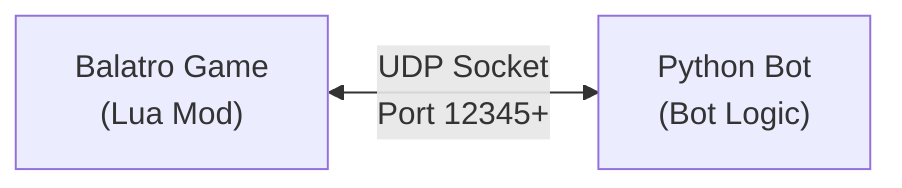
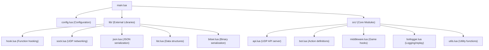
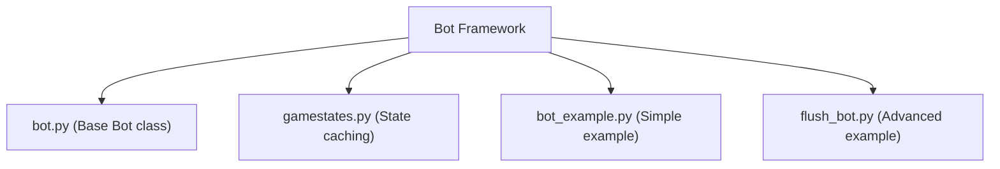
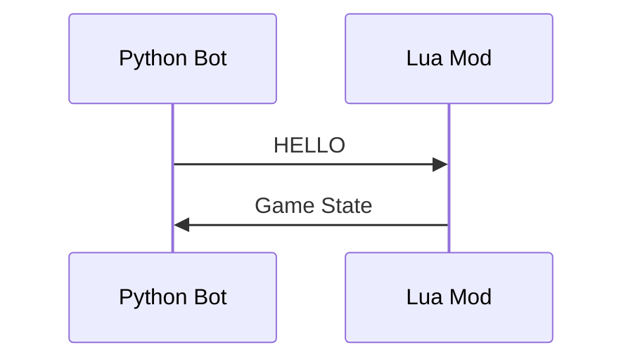
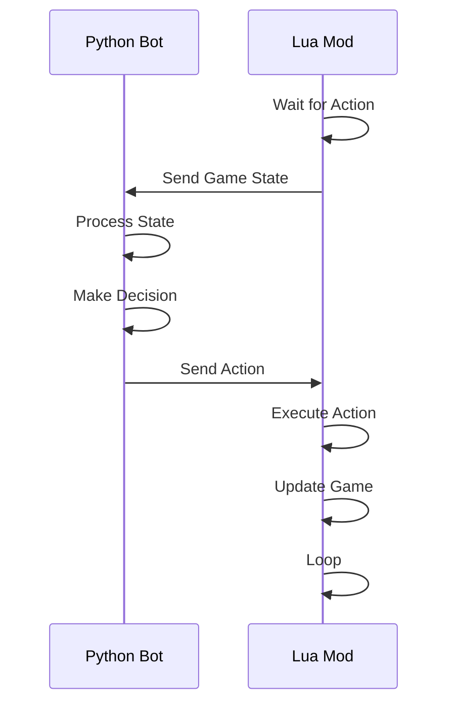

# Architecture

This document explains the architecture and design of the Balatrobot system, including how components interact and communicate.

## System Overview

Balatrobot consists of two main components working together:

1. **Lua Mod (Game-side)**: Runs inside Balatro via Steamodded
2. **Python Bot (External)**: Contains bot logic and decision-making

These components communicate via UDP sockets to achieve real-time bot control.



## Component Architecture

### Lua Mod Components

The Lua mod consists of several interconnected modules:



#### Key Modules

- **`api.lua`**: UDP server that handles communication with Python bots
- **`middleware.lua`**: Hooks into game functions to detect decision points
- **`bot.lua`**: Defines available actions and validation logic
- **`utils.lua`**: Game state extraction and data formatting
- **`botlogger.lua`**: Action logging and replay functionality

### Python Bot Components

The Python side provides the bot framework and decision-making logic:



#### Base Bot Class

The `Bot` class provides:
- UDP communication with the game
- Game state processing
- Action validation and sending
- Instance management

## Communication Flow

The communication between components follows this pattern:

### 1. Initialization



### 2. Decision Loop



### 3. Game State Structure

The game state sent to the bot contains:

```json
{
  "waitingFor": "select_cards_from_hand",
  "waitingForAction": true,
  "state": 1,
  "hand": [
    {
      "label": "base_card",
      "name": "3 of Hearts", 
      "suit": "Hearts",
      "value": 3,
      "card_key": "H_3"
    }
  ],
  "jokers": [...],
  "shop": {...},
  "ante": {...},
  "current_round": {...}
}
```

## Game State Management

### State Extraction

The `Utils.getGamestate()` function extracts comprehensive game information:

- **Hand**: Current cards in hand
- **Jokers**: Active jokers and their properties
- **Consumables**: Tarot cards, planet cards, etc.
- **Shop**: Available cards, boosters, vouchers
- **Ante**: Current blind information
- **Round**: Discards left, hands played, etc.
- **Game**: Dollars, round number, state flags

### State Validation

Before sending actions, the system validates:
- Action is valid for current game state
- Parameters are within acceptable ranges
- Required resources are available

## Action Processing

### Action Definition

Actions are defined in `bot.lua` with validation rules:

```lua
Bot.ACTIONPARAMS[Bot.ACTIONS.PLAY_HAND] = {
    num_args = 2,
    func = "select_cards_from_hand",
    isvalid = function(action)
        -- Validation logic
        return G.GAME.current_round.hands_left > 0 and
               Utils.isTableInRange(action[2], 1, #G.hand.cards)
    end,
}
```

### Action Execution

Actions are queued and executed through the middleware system:

1. **Validation**: Check if action is valid for current state
2. **Queueing**: Add to appropriate execution queue
3. **Execution**: Execute via game's event system
4. **State Update**: Game state changes trigger next decision point

### Available Actions

| Action | Description | Parameters |
|--------|-------------|------------|
| `SELECT_BLIND` | Choose to play the current blind | None |
| `SKIP_BLIND` | Skip the current blind | None |
| `PLAY_HAND` | Play selected cards | Card indices |
| `DISCARD_HAND` | Discard selected cards | Card indices |
| `BUY_CARD` | Purchase shop card | Card index |
| `REROLL_SHOP` | Reroll shop contents | None |
| `END_SHOP` | Leave shop | None |
| `USE_CONSUMABLE` | Use tarot/planet card | Card index, targets |
| `SELL_JOKER` | Sell joker card | Joker index |

## Performance Optimizations

### Game Speed Optimizations

The mod includes several performance enhancements:

#### Time Manipulation
```lua
-- Speed up game time
if BALATRO_BOT_CONFIG.dt then
    love.update = Hook.addbreakpoint(love.update, function(dt)
        return BALATRO_BOT_CONFIG.dt  -- Default: 8/60 seconds
    end)
end
```

#### Visual Optimizations
```lua
-- Disable FPS cap
G.FPS_CAP = 999999.0

-- Instant movement (no animations)
function Moveable.move_xy(self, dt)
    self.VT.x = self.T.x
    self.VT.y = self.T.y
end

-- Render only every Nth frame
frame_ratio = 100  -- Render every 100th frame
```

#### Network Optimization
```lua
-- Non-blocking UDP receive
BalatrobotAPI.socket:settimeout(0)

-- Minimal network overhead
data, msg_or_ip, port_or_nil = BalatrobotAPI.socket:receivefrom()
```

### Multi-Instance Support

The system supports multiple bot instances by:
- Using different UDP ports for each instance
- Process isolation between game instances
- Independent state management

## Error Handling

### Action Validation
- Comprehensive parameter checking
- Game state consistency verification
- Graceful error responses

### Network Resilience
- Timeout handling for UDP communication
- Connection recovery mechanisms
- Robust message parsing

### Logging Integration
- Complete action history logging
- Replay capability for debugging
- Performance metrics tracking

---

*This architecture enables fast, reliable, and scalable bot development for Balatro.* 