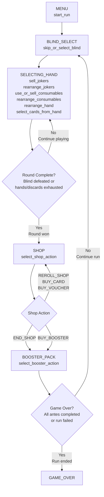

# Bot Development Guide

This guide teaches you how to create custom bots for Balatro using the Balatrobot framework.

## Overview

Balatrobot allows you to create automated players (bots) that can play Balatro by implementing decision-making logic in Python. Your bot communicates with the game through a socket connection, receiving game state information and sending back actions to perform.

A bot is essentially a Python class that inherits from the `Bot` base class and implements specific methods that get called at different points during gameplay.

## Bot Architecture

### Game State Flow

This diagram shows the main game states and the bot actions available in each state:



## Creating Your First Bot

Let's examine the example bot to understand how to implement your own:

```python
import itertools
from balatrobot import Actions, Bot

class MyFirstBot(Bot):
    def __init__(self, deck="Red Deck", stake=1, seed="EXAMPLE"):
        super().__init__(deck=deck, stake=stake, seed=seed)
        self.round_count = 0

    # ... method implementations
```

### Bot Class Structure

1. **Inheritance**: Your bot must inherit from the `Bot` base class
2. **Constructor**: Call `super().__init__()` with your desired game parameters
3. **Method Implementation**: Implement all required methods (the framework will verify this)

### Constructor Parameters

- `deck`: The deck to use (e.g., "Red Deck", "Blue Deck", etc.)
- `stake`: Difficulty level (1-8)
- `seed`: Random seed for reproducible games (optional)
- `challenge`: Challenge mode (optional)

## Required Methods

All bot methods receive a `G` parameter containing the current game state. The game state contains all information about the current situation, including cards in hand, jokers, consumables, blind information, and more.

!!! note
    For detailed information about the game state structure, see the [Game State Reference](game-state.md) page.

### skip_or_select_blind(G)

Called when the bot needs to choose whether to skip or select a blind.

```python
def skip_or_select_blind(self, G):
    """Always select blinds to play them"""
    return [Actions.SELECT_BLIND]
```

**When called:** At the start of each blind selection phase

**Return value:** List containing either `Actions.SELECT_BLIND` or `Actions.SKIP_BLIND`

### select_cards_from_hand(G)

Called when the bot needs to choose cards to play or discard during a round.

```python
def select_cards_from_hand(self, G):
    """Simple strategy: play the first card"""
    return [Actions.PLAY_HAND, [1, 2, 3, 4, 5]]
```

**When called:** During the playing phase when you need to make a hand

**Return value:** List containing either:
- `[Actions.PLAY_HAND, [card_indices]]` - Play specified cards
- `[Actions.DISCARD_HAND, [card_indices]]` - Discard specified cards

!!! tip
    Card indices are 1-based (first card is 1, not 0)

### select_shop_action(G)

Called when the bot is in the shop and needs to decide what to do.

```python
def select_shop_action(self, G):
    """Always leave the shop immediately"""
    return [Actions.END_SHOP]
```

**When called:** During the shop phase between rounds

**Return value:** List containing one of:
- `[Actions.END_SHOP]` - Leave the shop
- `[Actions.REROLL_SHOP]` - Reroll shop items
- `[Actions.BUY_CARD, card_index]` - Buy a joker
- `[Actions.BUY_VOUCHER, voucher_index]` - Buy a voucher
- `[Actions.BUY_BOOSTER, booster_index]` - Buy a booster pack

### select_booster_action(G)

Called when the bot encounters a booster pack and needs to choose cards or skip.

```python
def select_booster_action(self, G):
    """Skip all booster packs"""
    return [Actions.SKIP_BOOSTER_PACK]
```

**When called:** When opening booster packs

**Return value:** List containing either:
- `[Actions.SKIP_BOOSTER_PACK]` - Skip the pack
- `[Actions.SELECT_BOOSTER_CARD, [card_indices]]` - Select specific cards

### sell_jokers(G)

Called when the bot can sell jokers for money.

```python
def sell_jokers(self, G):
    """Don't sell any jokers"""
    return [Actions.SELL_JOKER, []]
```

**When called:** During joker management phases

**Return value:** List containing `[Actions.SELL_JOKER, [joker_indices]]`

### rearrange_jokers(G)

Called when the bot can rearrange the order of jokers.

```python
def rearrange_jokers(self, G):
    """Don't rearrange jokers"""
    return [Actions.REARRANGE_JOKERS, []]
```

**When called:** During joker management phases

**Return value:** List containing `[Actions.REARRANGE_JOKERS, [new_order]]`

### use_or_sell_consumables(G)

Called when the bot can use or sell consumable cards (Tarot, Planet, Spectral).

```python
def use_or_sell_consumables(self, G):
    """Don't use consumables"""
    return [Actions.USE_CONSUMABLE, []]
```

**When called:** During consumable management phases

**Return value:** List containing either:
- `[Actions.USE_CONSUMABLE, []]` - Don't use any consumables
- `[Actions.USE_CONSUMABLE, [card_index, target_indices]]` - Use a consumable
- `[Actions.SELL_CONSUMABLE, [card_indices]]` - Sell consumables

### rearrange_consumables(G)

Called when the bot can rearrange the order of consumable cards.

```python
def rearrange_consumables(self, G):
    """Don't rearrange consumables"""
    return [Actions.REARRANGE_CONSUMABLES, []]
```

**When called:** During consumable management phases

**Return value:** List containing `[Actions.REARRANGE_CONSUMABLES, [new_order]]`

### rearrange_hand(G)

Called when the bot can rearrange cards in hand.

```python
def rearrange_hand(self, G):
    """Don't rearrange hand"""
    return [Actions.REARRANGE_HAND, []]
```

**When called:** During hand management phases

**Return value:** List containing `[Actions.REARRANGE_HAND, [new_order]]`

## Running Your Bot

Once you've implemented all required methods, you can run your bot:

```python
# Run the bot
if __name__ == "__main__":
    bot = MyFirstBot()
    bot.running = True
    bot.run()
```

### Basic Bot Template

Here's a minimal bot template you can use as a starting point:

```python
from balatrobot import Actions, Bot

class MyBot(Bot):
    def __init__(self, deck="Red Deck", stake=1, seed=""):
        super().__init__(deck=deck, stake=stake, seed=seed)

    def skip_or_select_blind(self, G):
        return [Actions.SELECT_BLIND]

    def select_cards_from_hand(self, G):
        # Always play the first 5 cards
        return [Actions.PLAY_HAND, [1, 2, 3, 4, 5]]

    def select_shop_action(self, G):
        return [Actions.END_SHOP]

    def select_booster_action(self, G):
        return [Actions.SKIP_BOOSTER_PACK]

    def sell_jokers(self, G):
        return [Actions.SELL_JOKER, []]

    def rearrange_jokers(self, G):
        return [Actions.REARRANGE_JOKERS, []]

    def use_or_sell_consumables(self, G):
        return [Actions.USE_CONSUMABLE, []]

    def rearrange_consumables(self, G):
        return [Actions.REARRANGE_CONSUMABLES, []]

    def rearrange_hand(self, G):
        return [Actions.REARRANGE_HAND, []]

if __name__ == "__main__":
    bot = MyBot()
    bot.running = True
    bot.run()
```

## Next Steps

- **Game State Reference**: Learn about the structure of the `G` parameter passed to your methods
- **Actions Reference**: Explore all available actions and their parameters
- **Advanced Strategies**: Implement more sophisticated decision-making logic
- **Debugging**: Use the game state cache to analyze your bot's decisions

!!! tip
    Start simple! Copy the basic template above and gradually add more sophisticated logic as you understand the game flow better.

---

*Ready to create more advanced bots? Check out the [Game State Reference](game-state.md) and [Actions Reference](actions.md) for detailed information about available data and actions.*
