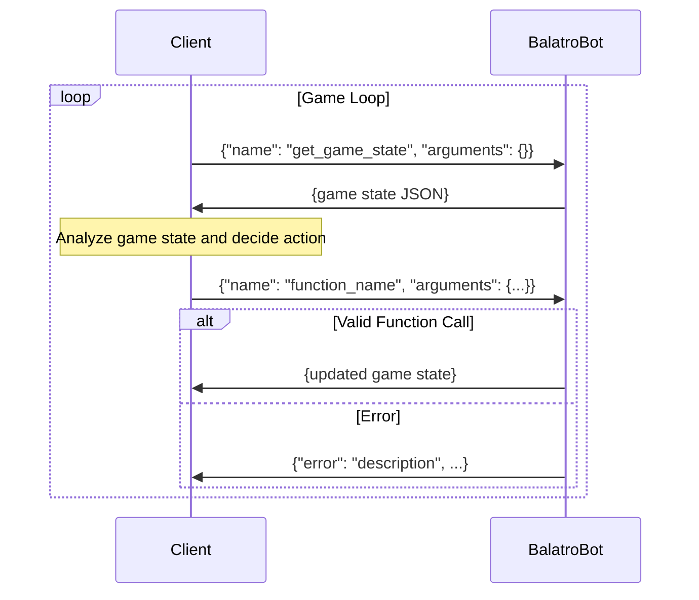

# Protocol API

This document provides the TCP API protocol reference for developers who want to interact directly with the BalatroBot game interface using raw socket connections.

## Protocol

The BalatroBot API establishes a TCP socket connection to communicate with the Balatro game through the BalatroBot Lua mod. The protocol uses a simple JSON request-response model for synchronous communication.

- **Host:** `127.0.0.1` (localhost)
- **Port:** `12346` (default)
- **Message Format:** JSON

### Communication Sequence

The typical interaction follows a game loop where clients continuously query the game state, analyze it, and send appropriate actions:



### Message Format

All communication uses JSON messages with a standardized structure. The protocol defines three main message types: function call requests, successful responses, and error responses.

**Request Format:**

```json
{
  "name": "function_name",
  "arguments": {
    "param1": "value1",
    "param2": ["array", "values"]
  }
}
```

**Response Format:**

```json
{
  "state": 7,
  "game": { ... },
  "hand": [ ... ],
  "jokers": [ ... ]
}
```

**Error Response Format:**

```json
{
  "error": "Error message description",
  "error_code": "E001",
  "state": 7,
  "context": {
    "additional": "error details"
  }
}
```

## Game States

The BalatroBot API operates as a finite state machine that mirrors the natural flow of playing Balatro. Each state represents a distinct phase where specific actions are available.

### Overview

The game progresses through these states in a typical flow: `MENU` → `BLIND_SELECT` → `SELECTING_HAND` → `ROUND_EVAL` → `SHOP` → `BLIND_SELECT` (or `GAME_OVER`).

| State            | Value | Description                  | Available Functions                      |
| ---------------- | ----- | ---------------------------- | ---------------------------------------- |
| `MENU`           | 11    | Main menu screen             | `start_run`                              |
| `BLIND_SELECT`   | 7     | Selecting or skipping blinds | `skip_or_select_blind`                   |
| `SELECTING_HAND` | 1     | Playing or discarding cards  | `play_hand_or_discard`, `rearrange_hand` |
| `ROUND_EVAL`     | 8     | Round completion evaluation  | `cash_out`                               |
| `SHOP`           | 5     | Shop interface               | `shop`                                   |
| `GAME_OVER`      | 4     | Game ended                   | `go_to_menu`                             |

### Validation

Functions can only be called when the game is in their corresponding valid states. The `get_game_state` function is available in all states.

!!! tip "Game State Reset"

    The `go_to_menu` function can be used in any state to reset a run. However,
    run resuming is not supported by BalatroBot. So performing a `go_to_menu` is
    effectively equivalent to resetting the run. This can be used to restart the
    game to a clean state.

## Game Functions

The BalatroBot API provides core functions that correspond to the main game actions. Each function is state-dependent and can only be called in the appropriate game state.

### Overview

| Name                   | Description                                                                                 |
| ---------------------- | ------------------------------------------------------------------------------------------- |
| `get_game_state`       | Retrieves the current complete game state                                                   |
| `go_to_menu`           | Returns to the main menu from any game state                                                |
| `start_run`            | Starts a new game run with specified configuration                                          |
| `skip_or_select_blind` | Handles blind selection - either select the current blind to play or skip it                |
| `play_hand_or_discard` | Plays selected cards or discards them                                                       |
| `rearrange_hand`       | Reorders the current hand according to the supplied index list                              |
| `cash_out`             | Proceeds from round completion to the shop phase                                            |
| `shop`                 | Performs shop actions: proceed to next round (`next_round`) or purchase a card (`buy_card`) |

### Parameters

The following table details the parameters required for each function. Note that `get_game_state` and `go_to_menu` require no parameters:

| Name                   | Parameters                                                                                                                                                                                                                                                                |
| ---------------------- | ------------------------------------------------------------------------------------------------------------------------------------------------------------------------------------------------------------------------------------------------------------------------- |
| `start_run`            | `deck` (string): Deck name<br>`stake` (number): Difficulty level 1-8<br>`seed` (string, optional): Seed for run generation<br>`challenge` (string, optional): Challenge name<br>`log_path` (string, optional): Full file path for run log (must include .jsonl extension) |
| `skip_or_select_blind` | `action` (string): Either "select" or "skip"                                                                                                                                                                                                                              |
| `play_hand_or_discard` | `action` (string): Either "play_hand" or "discard"<br>`cards` (array): Card indices (0-indexed, 1-5 cards)                                                                                                                                                                |
| `rearrange_hand`       | `cards` (array): Card indices (0-indexed, exactly `hand_size` elements)                                                                                                                                                                                                   |
| `shop`                 | `action` (string): Shop action ("next_round" or "buy_card")<br>`index` (number, required when `action` = "buy_card"): 0-based card index to purchase                                                                                                                      |

### Errors

All API functions validate their inputs and game state before execution. Error responses include an `error` message, standardized `error_code`, current `state` value, and optional `context` with additional details.

| Code   | Category   | Error                                      |
| ------ | ---------- | ------------------------------------------ |
| `E001` | Protocol   | Invalid JSON in request                    |
| `E002` | Protocol   | Message missing required 'name' field      |
| `E003` | Protocol   | Message missing required 'arguments' field |
| `E004` | Protocol   | Unknown function name                      |
| `E005` | Protocol   | Arguments must be a table                  |
| `E006` | Network    | Socket creation failed                     |
| `E007` | Network    | Socket bind failed                         |
| `E008` | Network    | Connection failed                          |
| `E009` | Validation | Invalid game state for requested action    |
| `E010` | Validation | Invalid or missing required parameter      |
| `E011` | Validation | Parameter value out of valid range         |
| `E012` | Validation | Required game object missing               |
| `E013` | Game Logic | Deck not found                             |
| `E014` | Game Logic | Invalid card index                         |
| `E015` | Game Logic | No discards remaining                      |
| `E016` | Game Logic | Invalid action for current context         |

## Implementation

For higher-level integration:

- Use the [BalatroBot API](balatrobot-api.md) `BalatroClient` for managed connections
- See [Developing Bots](developing-bots.md) for complete bot implementation examples
